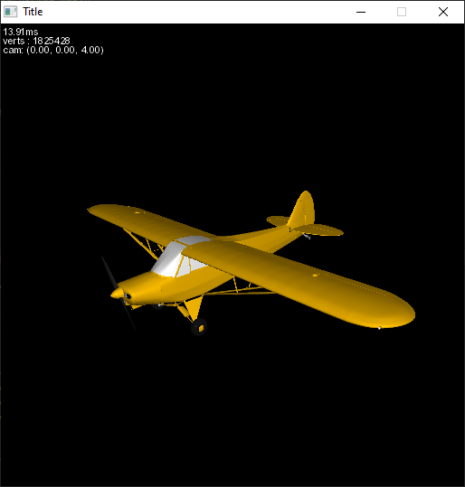

## Graphika

Graphika utilizes SDL2, MSVC, OpenMP, and SIMD, to facilitate the rasterization of an OBJ model. The list of possible raster methods used are as follows:

<p align="center">
  
</p>

### Raster Methods
- ```edging.h``` - using the edge equation to determine if a pixel is inside or outside of the triangle
- ```stepping.h``` - same idea as edging, but we dont calculate the edge equation for every pixel, instead, we calculate it for a starting pixel and increment it in the x and y direction to cover the entire triangle
- ```avx.h``` - using SIMD instructions to improve the performance of the stepping method
- ```matrix.h``` - [Incremental and Hierarchical Hilbert Order Edge Equation Polygon Rasterization](https://doi.org/10.1145/383507.383528)
- ```phong.h``` - Phong lighting implemented using the avx method for rasterising
- ```normal_map.h``` - Normal Mapping implemented using the avx method for rasterising
- ```parallax.h``` - Different Parallax mapping techniques implemented using the avx method; Offset, Steep, Relief and Parallax Occlusion Mapping (POM)  
